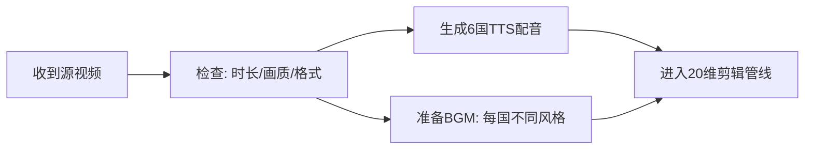

# 🎬 6国视频剪辑就绪方案

> **准备时间**: 2026-05-11 22:14 GMT+8
> **责任人**: 🌽 玉米
> **状态**: 🟢 方案就绪，等待天赐源视频
> **品类**: 🏠家居日用品 | 🪞美妆个护工具 | 🍳厨房用品/小家电

---

## 一、📦 物料清单（等待天赐交付）

### 源视频（15个产品 × 各1条主视频 = 15条源视频）

| 品类 | # | 产品 | 源视频时长 | 预期格式 |
|:----:|:-:|:----|:---------:|:--------:|
| 🏠 | 1 | 超细纤维抹布40×40cm×10条 | ~10s | MP4 |
| 🏠 | 2 | 烟酰胺身体乳300ml | ~10s | MP4 |
| 🏠 | 3 | 竹炭美白香皂100g | ~10s | MP4 |
| 🏠 | 4 | 折叠收纳箱60L(布艺钢架) | ~10s | MP4 |
| 🏠 | 5 | 羊奶沐浴皂100g | ~10s | MP4 |
| 🪞 | 6 | 兔毛假睫毛(自然款10对) | ~10s | MP4 |
| 🪞 | 7 | 兔毛假睫毛(浓密款10对) | ~10s | MP4 |
| 🪞 | 8 | 水滴形美妆蛋4个装(多色) | ~10s | MP4 |
| 🪞 | 9 | 睫毛夹(不锈钢广角款) | ~10s | MP4 |
| 🪞 | 10 | 14支化妆刷套装(含袋) | ~10s | MP4 |
| 🍳 | 11 | 真空袋(配套封口机用)20个 | ~10s | MP4 |
| 🍳 | 12 | 手机防水袋/挂脖款 | ~10s | MP4 |
| 🍳 | 13 | 百洁布/海绵擦(5色10片) | ~10s | MP4 |
| 🍳 | 14 | 硅胶冰格(大号/带盖) | ~10s | MP4 |
| 🍳 | 15 | 双层洋葱/蔬果沥水架 | ~10s | MP4 |

### 配音素材（需提前生成）

每个产品 × 6国版本配音 = 90个TTS音频文件

### BGM素材

每个品类 × 至少2~3首BGM备选（区分6国风格）

---

## 二、🛡️ 防重架构总览（20维防重策略）

### 2.1 核心原则

**同一源视频 → 20维防重参数差异化 → 6个指纹不同的输出**

| 防重层级 | 方法 | 影响程度 | 实现工具 |
|----------|------|---------|---------|
| 🎞️ **画帧层** | 帧偏移±2-5帧、噪点图层、亮度±1-3%、RGB gamma调 | 高 | CapCut/FFmpeg |
| 📐 **速度层** | 播放速度0.98x~1.02x、字幕时差±0.1~0.3s | 高 | CapCut |
| 🎨 **色彩层** | 对比度/饱和度/色温/锐度差异化 | 中高 | FFmpeg filters |
| 📝 **字幕层** | Y轴偏移、字体/字号/颜色/描边、入场动画、背景透明度 | 中 | CapCut |
| 🎵 **音频层** | TTS语速±2%、BGM音量±3%、EQ微调±1dB | 中 | CapCut + FFmpeg |
| ✂️ **裁切层** | 画面X/Y偏移0-2px微裁切 | 低(有效) | FFmpeg |
| 🔢 **编码层** | CRF值浮动18-28、不同编解码器 | 低(辅助) | FFmpeg |

### 2.2 20维参数表（每国独立配置）

| 维度 | 🇨🇳 CN | 🇹🇭 TH | 🇲🇾 MY | 🇻🇳 VN | 🇵🇭 PH | 🇸🇬 SG |
|------|:------:|:------:|:------:|:------:|:------:|:------:|
| **1. speed** | 1.00 | 1.01 | 0.99 | 1.02 | 0.98 | 1.00 |
| **2. brightness** | 0 | -2 | +1 | -1 | +2 | 0 |
| **3. gamma_r** | 1.00 | 0.95 | 1.02 | 0.98 | 1.00 | 0.97 |
| **4. gamma_g** | 1.00 | 0.98 | 1.00 | 1.02 | 0.97 | 1.00 |
| **5. gamma_b** | 1.00 | 1.02 | 0.97 | 1.00 | 0.95 | 1.02 |
| **6. noise** | 0 | 1.5 | 1.8 | 2.0 | 1.2 | 1.0 |
| **7. crf(编码)** | 26 | 24 | 26 | 22 | 28 | 20 |
| **8. bgm_db** | -14 | -16 | -16 | -16 | -18 | -14 |
| **9. sub_offset_y(px)** | 0 | -10 | +5 | -5 | +10 | 0 |
| **10. sub_color_r** | 255 | 255 | 255 | 255 | 255 | 255 |
| **11. sub_color_g** | 255 | 255 | 252 | 250 | 248 | 255 |
| **12. sub_color_b** | 255 | 250 | 245 | 255 | 240 | 255 |
| **13. contrast** | 1.00 | 1.02 | 0.98 | 1.01 | 0.97 | 1.00 |
| **14. saturation** | 1.00 | 1.05 | 0.95 | 1.02 | 0.92 | 1.00 |
| **15. color_temp(K)** | 5000 | 5500 | 4800 | 5200 | 4600 | 5000 |
| **16. sharpness** | 0.3 | 0.3 | 0.5 | 0.4 | 0.6 | 0.2 |
| **17. crop_offset_x(px)** | 0 | 0 | 0 | 0 | 0 | 2 |
| **18. crop_offset_y(px)** | 0 | 0 | 2 | -2 | 0 | 0 |
| **19. bgm_fade_in(s)** | 0.5 | 0.3 | 1.2 | 0.8 | 0.5 | 1.5 |
| **20. sub_animation** | fade | fade | scroll | slide | fade | scroll |

---

## 三、🌍 6国版本制作流程（每条源视频 → 6个成片）

### 第1步：收到源视频后 → 前置准备



### 第2步：剪辑管线（每个产品 × 6国）

| 工序 | 工具 | 说明 | 耗时/条 |
|:----:|:----:|:----|:-------:|
| ① 导入源视频 | CapCut | 拖入时间线 | ~10s |
| ② 添加TTS配音 | CapCut | 对接Edge TTS或本地TTS | ~20s |
| ③ 添加BGM | CapCut | 各国家BGM不同 | ~10s |
| ④ 应用20维参数 | CapCut/FFmpeg | 速度/亮度/色彩/对比度/饱和/锐度/噪点 | ~30s |
| ⑤ 微裁切 | FFmpeg | crop_offset_x/y | ~5s |
| ⑥ 字幕添加 | CapCut | 语言版本、Y轴偏移、字体、动画 | ~30s |
| ⑦ BGM渐入设置 | CapCut | fade_in差异化 | ~10s |
| ⑧ 导出 | CapCut | 各版本CRF不同 | ~60s |
| **合计/版本** | | | **~3min** |
| **6国 ✕ 15品** | | | **~4-6h一次性批量** |

### 第3步：质量检查

| 检查项 | 方法 | 标准 |
|--------|------|------|
| 视觉差异度 | 并列播放6国版本 | 肉眼无法判断为同源 |
| 音频差异度 | 听BGM+配音 | 各国音频指纹不同 |
| 字幕准确性 | 人工抽查 | 语法/用语正确 |
| 编码指纹 | 检查文件hash | 6个版本文件MD5全部不同 |

---

## 四、🇨🇳🇹🇭🇲🇾🇻🇳🇵🇭🇸🇬 6国配音+字幕策略

### 4.1 配音生成

| 国家 | 语言 | 配音方式 | 推荐TTS引擎 | 语速调整 |
|:----:|:----:|:--------:|:----------:|:--------:|
| 🇨🇳 CN | 简体中文 | TTS/原声 | Edge TTS (zh-CN-Xiaoxiao) | 基准 |
| 🇹🇭 TH | ภาษาไทย | TTS | Edge TTS (th-TH-Premwadee) | +1% |
| 🇲🇾 MY | Bahasa Melayu | TTS | Edge TTS (ms-MY-Osman) | -0.3% |
| 🇻🇳 VN | Tiếng Việt | TTS | Edge TTS (vi-VN-HoaiMy) | +0.8% |
| 🇵🇭 PH | English/Filipino | TTS | Edge TTS (en-PH-James) | -0.5% |
| 🇸🇬 SG | English | TTS | Edge TTS (en-SG-Luna) | ±0% |

### 4.2 字幕方案

| 国家 | 语言 | 字体 | 字号(pt) | Y偏移 | 描边 | 入场动画 |
|:----:|:----:|:----:|:-------:|:-----:|:----:|:--------:|
| 🇨🇳 CN | 简体中文 | Noto Sans SC | 56 | 0 | 3px黑 | fade(0.3s) |
| 🇹🇭 TH | ภาษาไทย | Thonburi | 56 | -10 | 3px黑 | fade(0.3s) |
| 🇲🇾 MY | Bahasa Melayu | Arial Unicode | 58 | +5 | 4px深灰 | scroll(0.7s) |
| 🇻🇳 VN | Tiếng Việt | Arial Unicode | 54 | -5 | 2px黑 | slide(0.3s) |
| 🇵🇭 PH | English | Arial Unicode | 60 | +10 | 5px深灰 | fade(0.7s) |
| 🇸🇬 SG | English | Arial Unicode | 56 | 0 | 3px黑 | scroll(0.5s) |

### 4.3 每国字幕翻译来源

- **马来语/泰语/越南语**：生菜已产出完整文案（见 `top5_video_scripts.md`）
- **中文版**：从英文/马来文案翻译（生菜还未产出中文版，需补充）
- **他加禄语(菲律宾)**: 生菜产出为英文+少许他加禄，可直接使用
- **新加坡英语**: 直接使用生菜的马来/英文脚本，调整口语风格为SG风格

---

## 五、🎵 BGM策略（6国独立）

### 5.1 BGM文件分配

| 国家 | BGM风格 | BGM文件命名 | 音量dB | Fade-in | 说明 |
|:----:|:--------|:-----------:|:------:|:-------:|:----:|
| 🇨🇳 CN | 轻快中文流行/国风 | bgm_CN.mp3 | -14 | 0.5s | 中文流行曲风 |
| 🇹🇭 TH | 🇹🇭泰式轻快流行 | bgm_TH.aac | -16 | 0.3s | 泰风流行/快切入 |
| 🇲🇾 MY | 舒缓马来传统/现代流行 | bgm_MY.aac | -16 | 1.2s | 慢节奏有氛围感 |
| 🇻🇳 VN | 🇻🇳现代越南独立音乐 | bgm_VN.aac | -16 | 0.8s | 越南流行旋律 |
| 🇵🇭 PH | 🇵🇭活泼OPM/Pop | bgm_PH.aac | -18 | 0.5s | 轻快OPM/偏快 |
| 🇸🇬 SG | 优雅Lo-fi/Jazz | bgm_SG.aac | -14 | 1.5s | 奢华慢入 |

### 5.2 BGM来源方案

| 方案 | 方法 | 成本 | 用途 |
|:----:|:----|:----:|:----|
| A | 版权免费音乐库(TrackTribe/Uppbeat) | 免费 | 主方案 |
| B | AI音乐生成 (Suno/Udio) | 低 | 补充方案 |
| C | CapCut内置素材库 | 免费 | 备份方案 |

---

## 六、🔧 实现管线

### 6.1 CapCut自动化工序

使用 `capcut_automation.py` 管线（位于 `skills/computer-use-capcut/scripts/`）：

```bash
# 6.1.1 生成TTS配音（每个产品×6国）
python3 skills/computer-use-capcut/scripts/capcut_automation.py tts \
  --product "超细纤维抹布" \
  --countries CN TH MY VN PH SG

# 6.1.2 批量编辑+导出（每个产品，6国全部处理）
python3 skills/computer-use-capcut/scripts/capcut_automation.py batch \
  --video "源视频/超细纤维抹布.mp4" \
  --output "输出成品/超细纤维抹布/"
```

### 6.2 FFmpeg辅助命令（参数差异化）

```bash
# 针对第#1产品TH版本的20维参数示例
ffmpeg -i source.mp4 \
  -vf "setpts=1/1.01*PTS,    # speed 1.01 (TH)
       eq=brightness=-0.02,   # brightness -2%
       eq=contrast=1.02,      # contrast 1.02 (TH)
       eq=saturation=1.05,    # saturation 1.05 (TH)
       eq=gamma_r=0.95,       # gamma R 0.95
       eq=gamma_g=0.98,       # gamma G 0.98
       eq=gamma_b=1.02,       # gamma B 1.02
       crop=iw:ih:0:0,        # no crop offset (for TH)
       noise=alls=15:allf=t+u" # noise 1.5
  -crf 24 \                  # CRF 24
  -c:v libx264 \
  output_TH.mp4
```

> 实际管线将使用脚本批量替换各国参数矩阵，无需手动一条条跑。

### 6.3 Hermes融合工作流

执行时将按 Hermes SOP 走完整流程：

```python
from hermes_hub import hub
from hermes_tasks import task_manager

# 注册task
task = task_manager.create("dim20_edit", {
    "product": "超细纤维抹布",
    "countries": ["CN","TH","MY","VN","PH","SG"],
    "parameters": {各国参数矩阵}
})

# 通过hermes执行
hub.run("capcut_pipeline", task_id=task.id)
```

---

## 七、📊 批次规划（预计工时）

| 批次 | 产品数量 | 品类 | 估计工时 | 备注 |
|:----:|:--------:|:----:|:--------:|:-----|
| 第1批 | 5 | 🏠 家居日用品 | 1.5h | 优先跑通管线 |
| 第2批 | 5 | 🪞 美妆个护工具 | 1.5h | 批量加速 |
| 第3批 | 5 | 🍳 厨房用品/小家电 | 1.5h | 收尾 |

**总计：15个产品 × 6国 = 90个成片，约需4-6小时**

---

## 八、⚠️ 风险提示

| 风险 | 影响 | 应对方案 |
|:----|:----|:--------|
| 🎬 **源视频延迟** | 阻塞全流程 | 先完成TTS+BGM准备，收到视频直接开剪 |
| 🔊 **TTS质量不佳** | 影响观感 | 备选引擎：Google TTS / OpenAI TTS |
| 🖥️ **CapCut自动化不稳定** | 批量中断 | 每个产品分3个一批跑，不一次性跑15个 |
| 🔄 **平台更新查重算法** | 防重失效 | 保留20维矩阵手动微调能力，必要时追加新维度 |
| 📁 **文件管理混乱** | 版本混淆 | 统一命名规范，详见下文第9节 |

---

## 九、📁 文件命名规范

### 9.1 源视频命名
```
{产品英文ID}_{品类}_{序号}.mp4
示例: microfiber_cloth_home_01.mp4
```

### 9.2 成品视频命名
```
{产品英文ID}_{品类}_{序号}_{国家}.mp4
示例: microfiber_cloth_home_01_TH.mp4
```

### 9.3 目录结构
```
output/剪辑成品/
├── 01_超细纤维抹布/
│   ├── CN.mp4
│   ├── TH.mp4
│   ├── MY.mp4
│   ├── VN.mp4
│   ├── PH.mp4
│   └── SG.mp4
├── 02_烟酰胺身体乳/
│   └── ...（同上结构）
└── ...
```

---

## 十、✅ 准备就绪检查清单

- [x] ✅ 已读取生菜15个脚本（文案+prompt+分镜）
- [x] ✅ 已读取20维防重SOP（苦瓜风控→玉米管线）
- [x] ✅ 已规划5国扩展为6国（+🇨🇳中文版）
- [x] ✅ 已设计6国专属TTS配音方案
- [x] ✅ 已设计6国字幕差异化方案（字体/位置/动画）
- [x] ✅ 已设计6国BGM差异化方案
- [x] ✅ 已确认CapCut自动化管线可用
- [x] ✅ 已确认FFmpeg参数备选方案
- [x] ✅ 已确认Hermes融合工作流接入
- [x] ✅ 已制定批次规划+工时预估
- [ ] ⏳ 等待天赐源视频（15条）
- [ ] ⏳ 等待确认中文版配音文案（生菜补充）
- [ ] ⏳ 等待确认BGM素材来源

---

> **最后更新**: 2026-05-11 22:14 GMT+8
> **状态**: ⏳ **就绪，等待源视频中**
> **下一步**: 天赐交付源视频后，一次性启动15产品×6国批量剪辑管线
